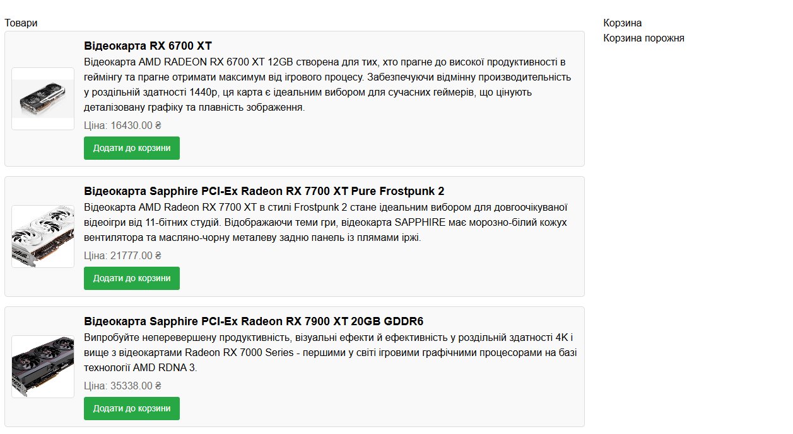
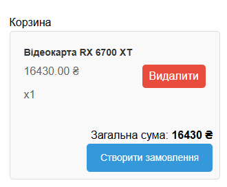
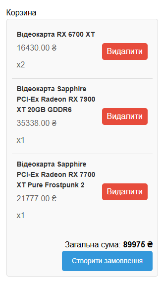

# Installation
`git clone https://github.com/lHappYzz/crmoz.git <project-dir>`

`cd <project-dir>`

`cp .env.example .env` Configure DB connection

`php arisan key:generate`

`php artisan migrate --seed`

`composer install`

`npm install & npm run build`

# Start page

  

# Cart filled with 1 product

  

# Cart filled with 4 products

  

# Order creation success message

  

